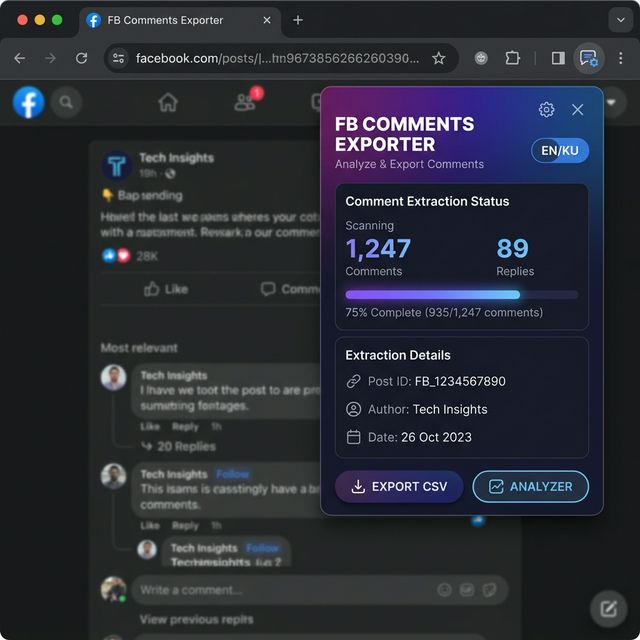

# 🗨️ FB Comments Exporter

**Extract, analyze, and export Facebook comments** — as a Chrome Extension or a standalone web tool.

Supports **Kurdish (Sorani)** 🇮🇶 and **English** 🇬🇧 bilingual interface.



---

## ✨ Features

| Feature | Extension | Standalone |
|---|:---:|:---:|
| Extract comments from any FB post/video | ✅ | ✅ |
| Background extraction (popup can close) | ✅ | — |
| CSV / JSON export | ✅ | ✅ |
| Advanced CSV Analyzer (multi-file) | ✅ | ✅ |
| Giveaway winner picker (random / top) | ✅ | — |
| Leaderboard with charts | ✅ | ✅ |
| Shareable results link | ✅ | ✅ |
| Bilingual UI (Kurdish / English) | ✅ | ✅ |

---

## 🚀 Installation

### Chrome Extension (Recommended)

1. Download or clone this repository:
   ```bash
   git clone https://github.com/danyar82/fb--comments-tool.git
   ```
2. Open Chrome and go to `chrome://extensions/`
3. Enable **Developer mode** (toggle in top-right)
4. Click **Load unpacked**
5. Select the `fb-comments-exporter` folder
6. The extension icon will appear in your toolbar ✅

### Standalone Web Tool

1. Open `index.html` in any browser
2. Get a Facebook **Access Token** from [Graph API Explorer](https://developers.facebook.com/tools/explorer/)
3. Paste the token → select your page → extract comments

---

## 📖 Usage

### Extension Mode
1. Navigate to any Facebook post or video
2. Click the extension icon
3. Choose extraction method:
   - **Scroll Method** — scrolls and scrapes (no API needed)
   - **Hybrid Method** — uses both scrolling and API
4. Click **Export** to start
5. Download results as CSV or open in the Analyzer

### Standalone Mode
1. Open `index.html`
2. Enter your Access Token
3. Select a page and add video/post IDs
4. Click **Extract Comments**
5. Export as CSV or JSON, or share via link

### CSV Analyzer
- Open the Analyzer from the extension or `analyzer.html`
- Drag & drop multiple CSV files
- See combined leaderboard across all files
- Export or share results

---

## 🌐 Language Toggle

Click the **EN** / **KU** button in the header to switch between:
- **کوردی (Kurdish Sorani)** — default
- **English**

Your preference is saved automatically.

---

## 📁 Project Structure

```
fb-comments-tool/
├── index.html              # Standalone web tool
├── app.js                  # Standalone app logic
├── style.css               # Standalone styles
├── viewer.html             # Shared results viewer
├── screenshot.png          # README screenshot
├── fb-comments-exporter/   # Chrome Extension
│   ├── manifest.json       # Extension manifest (MV3)
│   ├── popup.html          # Extension popup UI
│   ├── popup.js            # Popup logic + i18n
│   ├── popup.css           # Popup styles
│   ├── background.js       # Service worker
│   ├── content.js          # Content script
│   ├── injected.js         # FB page scraper
│   ├── analyzer.html       # CSV Analyzer UI
│   ├── analyzer.js         # Analyzer logic + i18n
│   ├── analyzer.css        # Analyzer styles
│   └── icons/              # Extension icons
└── .gitignore
```

---

## 🛠️ Technologies

- **Vanilla JavaScript** — no frameworks, no build step
- **Chrome Extension Manifest V3**
- **Facebook Graph API v19.0**
- **jsonblob.com** — for shareable links (free, no signup)

---

## 📜 License

This project is open source and available under the [MIT License](LICENSE).

---

## 👤 Author

**Danyar** — [@danyar82](https://github.com/danyar82)

---

> Built with ❤️ for Facebook comment analysis • 2026
